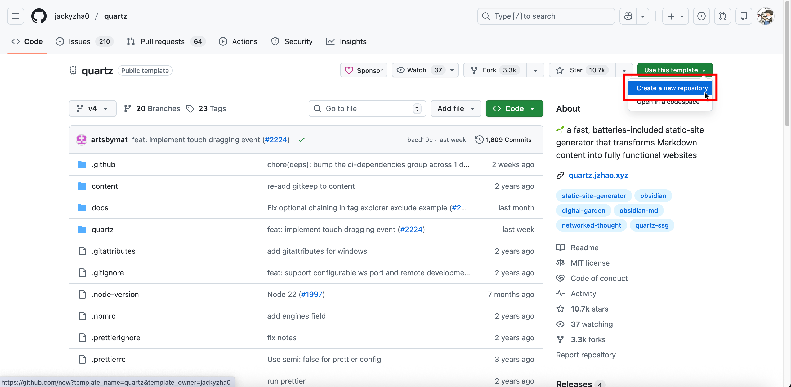
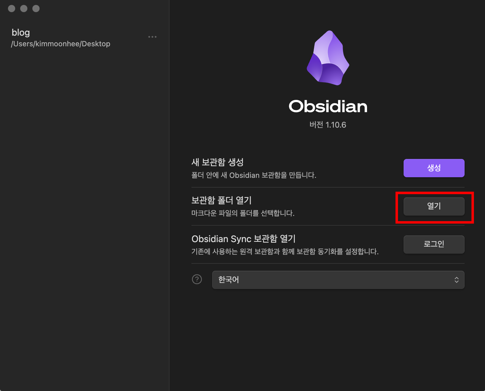
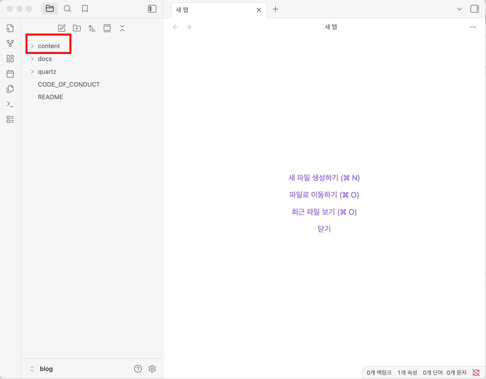
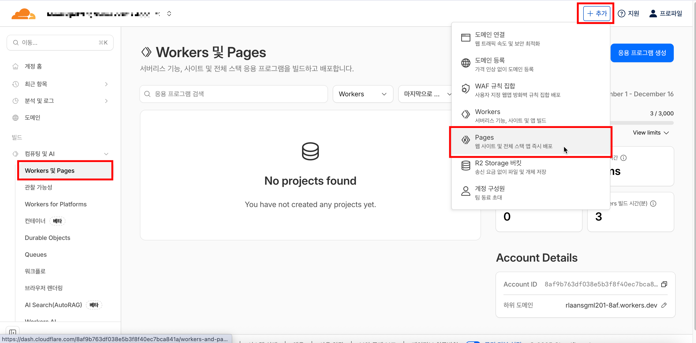
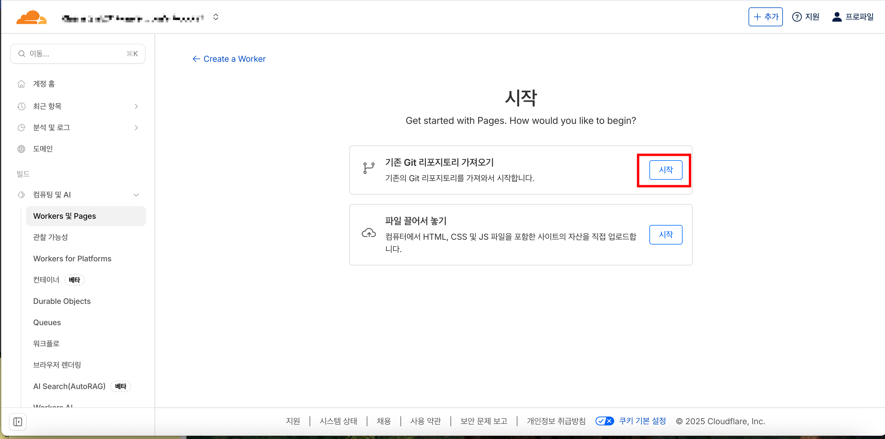
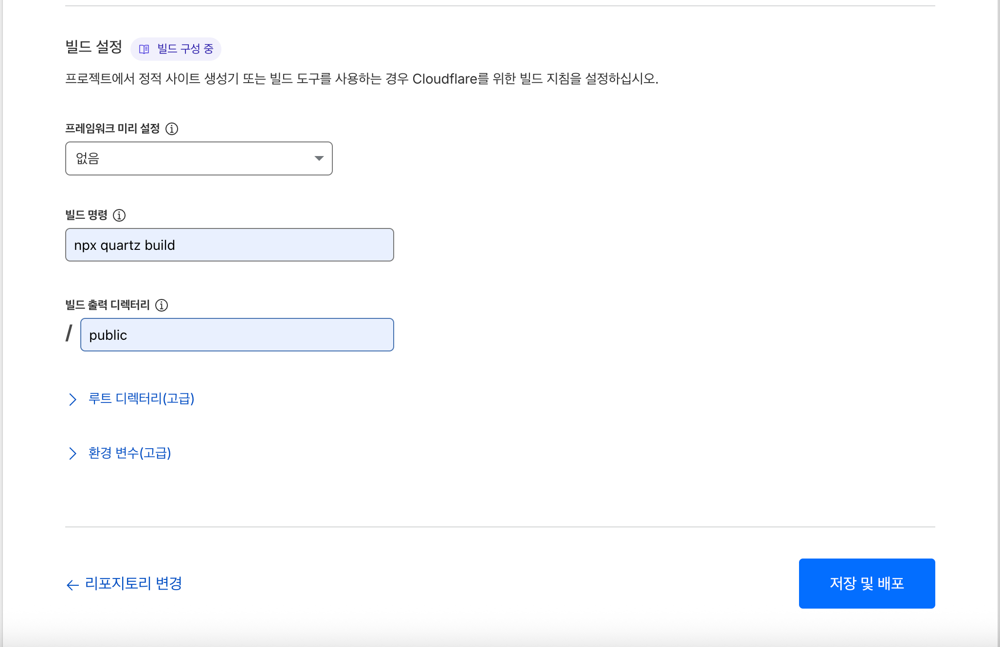
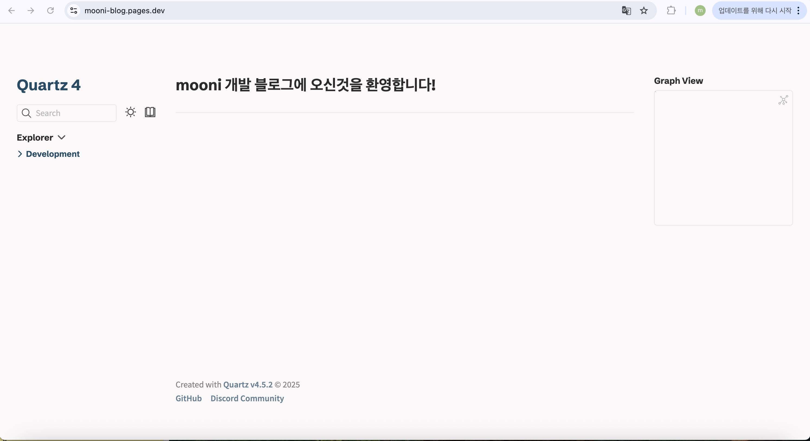

## 개요

Obsidian에서 작성한 노트를 Quartz로 정적 사이트로 변환하고, GitHub과 Cloudflare를 통해 배포하는 방법을 정리했습니다.

## 기술 스택

- **Obsidian**: 마크다운 기반 노트 작성 도구
- **Quartz**: Obsidian 노트를 정적 웹사이트로 변환하는 도구
- **GitHub**: 버전 관리 및 소스 코드 호스팅
- **Cloudflare Pages**: 정적 사이트 배포 및 CDN

## 세팅 과정

### 1. Quartz 설치

1. [Quartz GitHub 저장소](https://github.com/jackyzha0/quartz)에 접속
2. `Use this template` 버튼 클릭 → `Create a new repository` 선택



3. 새 repository 이름 입력 후 생성
4. 생성된 repository를 로컬로 clone

```bash
git clone https://github.com/<your-username>/<your-repo-name>.git
cd <your-repo-name>
npm install
```

### 2. Obsidian Vault 연결

1. Obsidian 실행 후 "보관함 폴더 열기" 선택



2. Quartz 프로젝트의 `content` 폴더 선택



3. `content` 폴더 안에 `index.md` 노트 생성 후 frontmatter 작성

> [!example] index.md 예시
> ```markdown
> ---
> title: mooni 개발 블로그에 오신것을 환영합니다!
> ---
> ```

### 3. 변경사항 GitHub에 Push

로컬에서 작성한 `content/index.md` 파일을 GitHub에 푸시합니다.

```bash
git add .
git commit -m "feat: index.md 생성"
git push
```

### 4. Cloudflare Pages 배포

1. Cloudflare 대시보드에서 **Workers & Pages** → **Create application** → **Pages** 선택



2. **Connect to Git**에서 GitHub repository 연결



3. 빌드 설정 입력



- **빌드 명령**: `npx quartz build`
- **빌드 출력 디렉터리**: `public`

4. **저장 및 배포** 클릭 후 배포 완료!




## 글 작성 워크플로우

1. Obsidian에서 글 작성 (`content/` 폴더)
2. Git commit & push
3. Cloudflare Pages에서 자동 배포

## 참고 자료

- [Quartz 공식 문서](https://quartz.jzhao.xyz/)
- [Cloudflare Pages 문서](https://developers.cloudflare.com/pages/)
